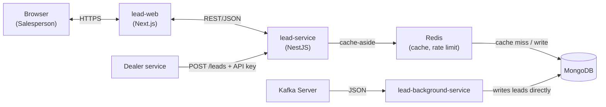
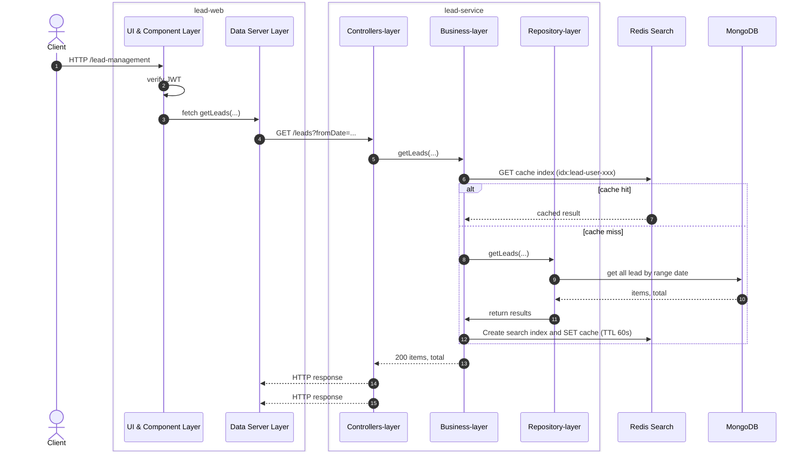
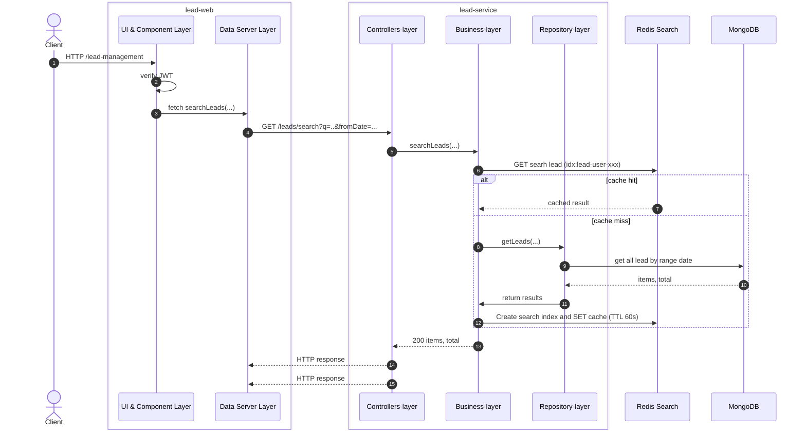
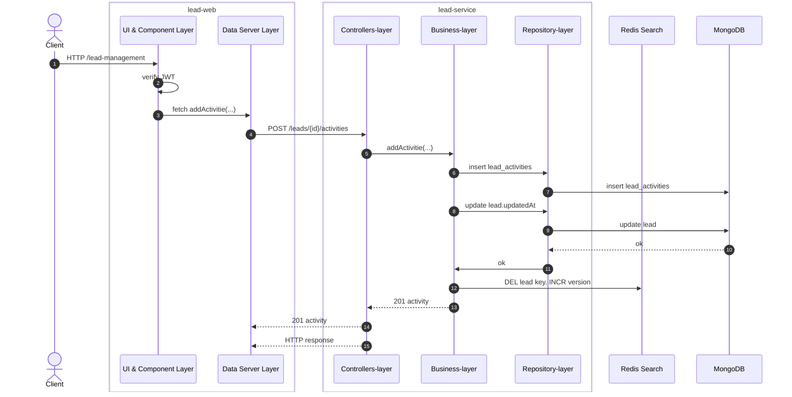
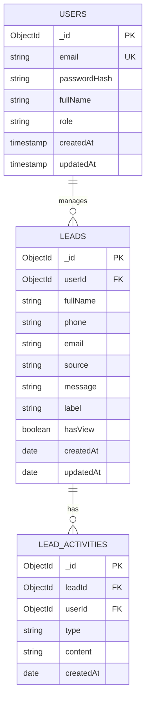

# System Design Document – The Sales Lead Management Tool

Version: 1.0 · Status: Proposed design

# Overview

**The Sales Lead Management Tool** helps salespeople at the car dealership manage and track leads coming from the dealership's website.

Main goals:

- Collect every website lead in one place (Lead Inbox).
- Record each follow-up in chronological order.
- Classify leads with labels and search quickly by name or phone number.

Out of scope for the MVP: advanced reporting, third-party CRM integration, mobile app.

# Requirements

## Functional

| # | Requirement | Description |
| --- | --- | --- |
| 1 | Lead Inbox | List of leads, newest first, filterable by date range and paginated; shows whether a lead has been viewed. |
| 2 | Lead Details | Full lead information and a chronological log of follow-up activities. |
| 3 | Activity Logging | Allow users to record new follow-up notes (e.g., "Called customer," "Inform discount"). Multiple entries can be made at different times, and the system displays this information on a timeline. |
| 4 | Label | Mark and change a lead's label (potential, spam, ...). |
| 5 | Search | Search leads by customer name or phone number. |

Assumptions:

- Leads enter the system through `POST /leads` or through Kafka events (background service).
- Each lead belongs to exactly one salesperson; a salesperson sees only their own leads, an Admin sees all.
- Customer information from leads has not yet been converted into actual customer records within the system, and the infrastructure for customer management has not yet been established.
## Non-Functional

| Attribute | Proposed target | How it is met |
| --- | --- | --- |
| Availability | 99.9% during working hours | At least 2 instances behind a load balancer; MongoDB replica set; if Redis fails, read directly from the DB. |
| Scalability | Tens of thousands of leads, hundreds of concurrent users | Stateless services scale horizontally; Redis cache; mandatory indexes and pagination; scale consumers by Kafka partition. |
| Latency | p95 < 300 ms for list and search | Redis cache-aside, indexed queries, `limit` capped at 200. |
| Security | Protect customer data | HTTPS; JWT with lead-ownership checks; input validation; rate limiting; API key for the lead source; no PII in logs. |

# System Architecture

## High-Level Diagram

Main flow: `Browser => lead-web => lead-service => Redis => MongoDB`. New leads arrive through `POST /leads` or from Kafka via lead-consumer.

lead-consumer writes leads straight to MongoDB, not through lead-service.

Design principles:

- lead-web only calls lead-service; the token is never exposed to the browser.
- Redis is a read cache; MongoDB is the source of truth.
- lead-consumer writes leads directly to MongoDB and does not store duplicates when an event is redelivered.

## Components

The system consists of one Next.js frontend (lead-web), one NestJS service (lead-service) and one background service that consumes Kafka (lead-consumer).

### Frontend: lead-web (Next.js)

- `/login`: sign in.
- `/leads`: Lead Inbox with a date-range filter, a search box for name or phone number, and pagination; unviewed leads are highlighted.
- `/leads/[id]`: lead details, label change, activity timeline, and a form to log an activity.
- JWT stored in an httpOnly cookie; lead-service is called from the server side (BFF); React Query for client-side caching.

### Backend: lead-service (NestJS)

| Module | Responsibility |
| --- | --- |
| LeadsModule | `POST /leads`, list, search, details (marks as viewed), label change. |
| LeadActivitiesModule | Log and list activities note of lead; updates the lead's `updatedAt`. |
| CacheModule | Redis cache-aside; if Redis fails, log the error and read from the DB. |

### Background service: lead-consumer

- Consumes lead events from Kafka, finds or creates the customer, and saves the lead to MongoDB.
- Idempotent: a redelivered event does not create a duplicate lead; failed events are retried, then sent to a dead-letter topic.
- Assigns the lead to a salesperson using the same rule as `POST /leads`.

**Cache (cache-aside):**

- List and search: key `leads:{userId}:{version}:{hash(query)}`, TTL 60 seconds.
- Lead details: key `lead:{id}`, TTL 5 minutes.
- On every write (new lead, label change, new activity, mark as viewed; lead-consumer too): delete `lead:{id}` and increment the user's `version` to invalidate cached lists.

## Sequence Diagram

### 1. Lead

### 2. Search lead

### 2. Activity action (log a new activity)

After the write, the lead's `updatedAt` is refreshed, so the lead moves to the top of the Lead Inbox.

# Database Design

## Relationship Diagram

- A user manages many leads.
- A lead maps to exactly 1 user
- A lead has many activities.

  
Assumptions: 
Customer information within the lead does not yet need to be stored separately or managed via the customer management system.

## Description

### 1. Collection `users` (Salesperson)

Identifies users and controls who manages which leads.

| Field | Type | Notes |
| --- | --- | --- |
| `_id` | ObjectId | PK |
| `email` | String | Unique |
| `passwordHash` | String | Hashed password |
| `fullName` | String | Full name |
| `role` | String | `SALESPERSON` or `ADMIN` |
| `createdAt` | Timestamp | Creation  time |
| `updatedAt` | Timestamp | Update time |
 

Index: `phone` (unique), text index on `fullName`.

### 3. Collection `leads` (Incoming leads)

| Field | Type | Notes |
| --- | --- | --- |
| `_id` | ObjectId | PK |
| `userId` | ObjectId | Ref `users`, responsible salesperson |
| `fullName` | String | Customer name |
| `phone` | String | normalized to a single format |
| `email` | String | Optional |
| `source` | String | Lead source (internal, external) |
| `message` | String | Message sent by the customer make lead |
| `label` | String | `UNLABELED` (default), `POTENTIAL`, `SPAM`, ... |
| `hasView` | Boolean | Whether it has been viewed, default `false` |
| `createdAt` | Timestamp | Create date time by |
| `updatedAt` | Timestamp | `updatedAt` is returned by the API as `lastUpdate` |

Indexes:

- `{ userId: 1, updatedAt: -1 }`: serves the Lead Inbox.

- Index: text index on `fullName`, `email`, `phone`.

`hasView` becomes `true` the first time a salesperson opens the lead details; `updatedAt` is refreshed when the label changes or an activity is added.

### 4. Collection `lead_activities` (Follow-up activity log)

| Field | Type | Notes |
| --- | --- | --- |
| `_id` | ObjectId | PK |
| `leadId` | ObjectId | Ref `leads` |
| `userId` | ObjectId | User who logged the activity |
| `type` | String | `CALL`, `EMAIL`, `SMS`, `NOTE`, `OTHER` |
| `content` | String | Content (for example "Called customer") |
| `createdAt` | Date | Used to order the timeline |

Index: `{ leadId: 1, createdAt: -1 }`. Activities are append-only: no edit or delete.

# APIs & Interfaces

Prefix `/api/v1`, JSON, authenticated with `Authorization: Bearer <JWT>` (only `POST /leads` uses the `x-api-key` header). Errors are returned as `{ statusCode, message, error }`.

| Endpoint| Method | Request | Response | Description |
| --- | --- | --- | --- | --- |
| `/api/v1/auth/login` | POST | Body: `{ email, password }` | 200: `{ accessToken, user }` | Sign in. |
| `/api/v1/leads` | POST | Header: `x-api-key`. Body: `{ fullName, phone, email?, message, source }` | 201: `{ id }` | Receive a new lead from the website; find or create the customer by phone number. |
| `/api/v1/leads` | GET | Query: `fromDate`, `toDate` (default: last 6 months), `page` (default 1), `limit` (default 20, max 200) | 200: `{ items: [{ id,  customerName, email, phone, label, hasView, lastUpdate }], page, limit, total }` | Lead Inbox, sorted by `lastUpdate` descending. |
| `/api/v1/leads/search` | GET | Query: `q` (name, email, or phone number), `fromDate`, `toDate` (default: last 6 months), `page` (default 1), `limit` (default 20, max 200) Same query as `/leads`, plus `q` (name or phone number) | Same as `GET /leads` | Search leads. |
| `/api/v1/leads/:id` | GET | Path: `id` | 200: `{ id, label, source, message, hasView, createdAt, customerName, phone, email, activities: [...] }`; 404 | Lead details and chronological activities; sets `hasView = true`. |
| `/api/v1/leads/:id/label` | PUT | Body: `{ label }` | 200: `{ id, label, lastUpdate }` | Change the label. |
| `/api/v1/leads/:id/view` | PUT | Body: `{ hasView }` | 200: `{ id, hasView, lastUpdate }` | Change the hasView. |
| `/api/v1/leads/:id/activities` | GET | Query: `page`, `limit` | 200: `{ items, page, limit, total }` | List a lead's activities. |
| `/api/v1/leads/:id/activities` | POST | Body: `{ type, content }` | 201: `{ id, leadId, type, content, createdAt }` | Log a new activity. |
| `/api/v1/health` | GET | — | 200: `{ status, db, redis }` | Health check. |

Error codes: 400 invalid data, 401 unauthenticated, 403 forbidden, 404 not found, 429 rate limit exceeded. In NestJS, declare the `/leads/search` route before `/leads/:id`.

# Testing

## Test Cases

**Strategy:** testing pyramid.

- **Unit (Jest):** service logic, default date range, cache invalidation, consumer idempotency.
- **Integration (Supertest):** API against real MongoDB and Redis (Testcontainers); consumer against a real Kafka.
- **E2E (Playwright):** sign in, open the inbox, search, open a lead, log an activity, change the label.
- **Non-functional (k6):** latency of `GET /leads` and `/leads/search`; authorization and rate-limit checks.

| ID | Area | Scenario | Expected result |
| --- | --- | --- | --- |
| TC-01 | Inbox | `GET /leads` with no parameters | Last 6 months, 20 leads per page, `lastUpdate` descending |
| TC-02 | Inbox | Narrow `fromDate`/`toDate`; `limit=500` | Only leads in the range; 400 when `limit` > 200 |
| TC-03 | Inbox | Salesperson A calls while B has leads | A does not see B's leads |
| TC-04 | Details | Open a lead with 3 activities | Full information, activities in chronological order, `hasView = true` |
| TC-05 | Details | Lead of another user, or nonexistent | 404 |
| TC-06 | Activity | Valid `POST` | 201, saved to DB, `lastUpdate` increases, persists after reload |
| TC-07 | Activity | Empty `content` or invalid `type` | 400, no record created |
| TC-08 | Label | Change to `SPAM`; send an invalid label | 200 with the new label; 400 |
| TC-09 | Search | `q` is part of a name | Matching leads returned |
| TC-10 | Search | `q` is a phone number, combined with a date range | Matching leads within the date range |
| TC-11 | Ingest | Valid `POST /leads`; wrong API key | 201, lead created, existing customer with the same phone reused; 401 |
| TC-12 | Kafka | Consume a valid event; same event delivered twice | Lead saved to MongoDB; only 1 lead exists |
| TC-13 | Cache | `GET /leads` twice in a row, then add an activity | 2nd call served from Redis; new data visible after the write |
| TC-14 | Resilience | Shut down Redis | API still correct, just slower |
| TC-15 | Security | Missing or expired JWT; `q` with special characters | 401; `q` treated as plain text |
| TC-16 | Performance | 200 concurrent users call `GET /leads` | p95 < 300 ms, errors < 1% |

# Conclusion

The design meets the MVP requirements with a simple architecture, `Browser → lead-web → lead-service → Redis → MongoDB`, plus lead-consumer receiving leads from Kafka. Stateless services, Redis caching and suitable indexes make it easy to scale and to hit the latency target.

**To confirm:** the rule for assigning leads to salespeople (for both `POST /leads` and Kafka); the Kafka event format (an event ID is needed to prevent duplicates); the initial list of labels.

**Future work:** real-time notification of new leads, follow-up reminders, multiple labels per lead.
