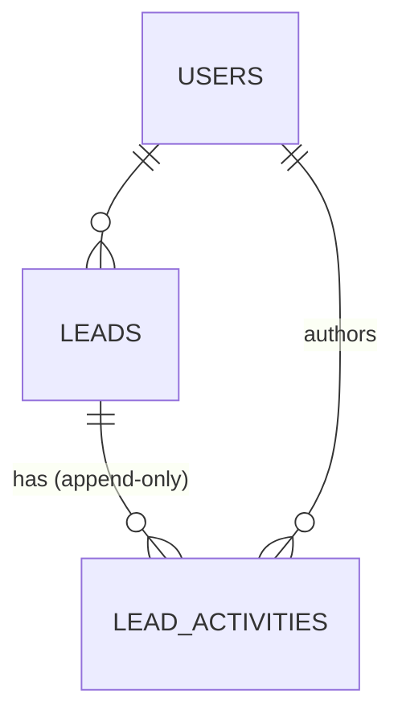

# Data Model: Lead Management

Code-first Mongoose schemas live in `packages/persistence/src/schemas/` and are the source of truth.
Collections follow the architecture document (`users`, `leads`, `lead_activities`).
Design rationale: [research.md](./research.md) R-03 – R-08, R-15, R-16.

## Relationships



- A lead belongs to at most one user (`userId`).
- Activities reference the lead and the author; they are never updated or deleted.
- Activities are a separate collection because they grow without bound (no embedded arrays).

## 1. `users`

| Field          | Type     | Rules                                                |
| -------------- | -------- | ---------------------------------------------------- |
| `_id`          | ObjectId | PK                                                   |
| `email`        | string   | required, unique, stored lower-case                  |
| `passwordHash` | string   | required; `scrypt$<salt>$<hash>` format; never returned |
| `fullName`     | string   | required, 1–120 chars                                |
| `role`         | string   | enum `SALESPERSON` (default) \| `ADMIN`              |
| `isActive`     | boolean  | default `true`; only active salespeople receive leads |
| `createdAt`    | Date     | set on insert                                        |
| `updatedAt`    | Date     | set on change                                        |

Indexes: `{ email: 1 }` unique.

## 2. `leads`

| Field               | Type     | Rules                                                                                          |
| ------------------- | -------- | ---------------------------------------------------------------------------------------------- |
| `_id`               | ObjectId | PK; exposed as `id`                                                                            |
| `userId`            | ObjectId | ref `users`;                                      |
| `fullName`          | string   | required, 1–120 chars, trimmed                                                                 |
| `phone`             | string   | required, normalized display form (digits with optional leading `+`), 7–20 digits              |
| `email`             | string   | optional, valid format, ≤ 254 chars                                                            |
| `message`           | string   | required, 1–2000 chars                                                                         |
| `source`            | string   | enum `INTERNAL` \| `EXTERNAL`                                                                  |
| `label`             | string   | enum `UNLABELED` (default) \| `POTENTIAL` \| `SPAM`; exactly one                               |
| `hasView`           | boolean  | default `false`; set `true` on first details open (no `updatedAt` change)                      |
| `schemaVersion`     | number   | default `1`                                                                                    |
| `createdAt`         | Date     | arrival time                                                                                   |
| `updatedAt`         | Date     | initially `createdAt`; moved forward by label change and new activity (returned as `lastUpdate`) |

Mongoose `timestamps` are **not** used for `updatedAt` (mark-read must not touch it); both dates are set
explicitly by the writer/repositories.

Indexes (all driven by named access patterns; no speculative indexes, per the schema-design skill):

| Index                                                                                                        | Serves                                                               |
| ------------------------------------------------------------------------------------------------------------ | -------------------------------------------------------------------- |
| `{ userId: 1, hasView: 1, updatedAt: -1 }`                                                                   | Inbox and search: owner equality → unread-first sort → date range    |
| `{ createdAt: 1 }`                                               | Lead search                                              |

Label filter and the search regex run as residual filters on the candidate set bounded by the first
index. Add `{ userId, label, hasView, updatedAt }` only if `explain` shows it is needed (R-06).

### State transitions

```text
Lead.hasView:           false ──(owner opens details)──▶ true      (one-way)
Lead.label:             any allowed value ──(owner sets label)──▶ any allowed value (replaces)
Lead.updatedAt:         createdAt ──(label change | new activity)──▶ later timestamp (never moves back)
```

## 3. `lead_activities` (append-only)

| Field        | Type     | Rules                                                                 |
| ------------ | -------- | --------------------------------------------------------------------- |
| `_id`        | ObjectId | PK                                                                    |
| `leadId`     | ObjectId | ref `leads`, required                                                 |
| `authorUserId`     | ObjectId | author, ref `users`, required                                         |
| `type`       | string   | enum `CALL` \| `EMAIL` \| `SMS` \| `NOTE` (default) \| `OTHER`        |
| `content`    | string   | required, trimmed, 1–2000 chars, non-whitespace                       |
| `createdAt`  | Date     | set once at insert                                                    |

Indexes: `{ leadId: 1, createdAt: -1 }` (timeline newest first; `_id` descending as tiebreak).

Append-only enforcement: the repository port has `add` and `list` only; there are no update/delete
routes; the schema sets `strict` and no update hooks are registered; an integration test asserts the HTTP
surface has no `PUT`/`PATCH`/`DELETE` for activities.

## 5. Redis keys (not persisted data)

| Key                                    | Value                         | TTL    | Invalidation                                         |
| -------------------------------------- | ----------------------------- | ------ | ---------------------------------------------------- |
| `leads:version:{userId}`               | integer                       | none   | `INCR` on every write affecting that user's leads    |
| `leads:{userId}:{version}`   | serialized page + total       | 60 s   | Implicit (version bump)                              |
| `lead:{id}`                            | lead document + `userId`      | 300 s  | `DEL` on every write to the lead                     |

## 6. Validation rules summary (from the spec)

| Rule                                                     | Enforced in                                         | FR            |
| -------------------------------------------------------- | --------------------------------------------------- | ------------- |
| Required: name, phone, message; optional email           | `CreateLeadRequest` DTO + zod event schema + schema | FR-026        |
| Phone/email format; phone normalized once                | shared normalizer (`@lead/persistence`) + DTO       | FR-026, FR-010|
| One label from the allowed set                           | DTO enum + schema enum                              | FR-015, FR-016|
| Note: non-empty after trim, ≤ 2000 chars                 | DTO + zod + schema                                  | FR-021        |
| `limit` ≤ 200, `page` ≥ 1, valid date range, `q` 2–100   | list/search query DTO                               | FR-005, FR-032|
| Ownership on every lead read/write                       | `userId` in every repository filter                 | FR-001, FR-014|
